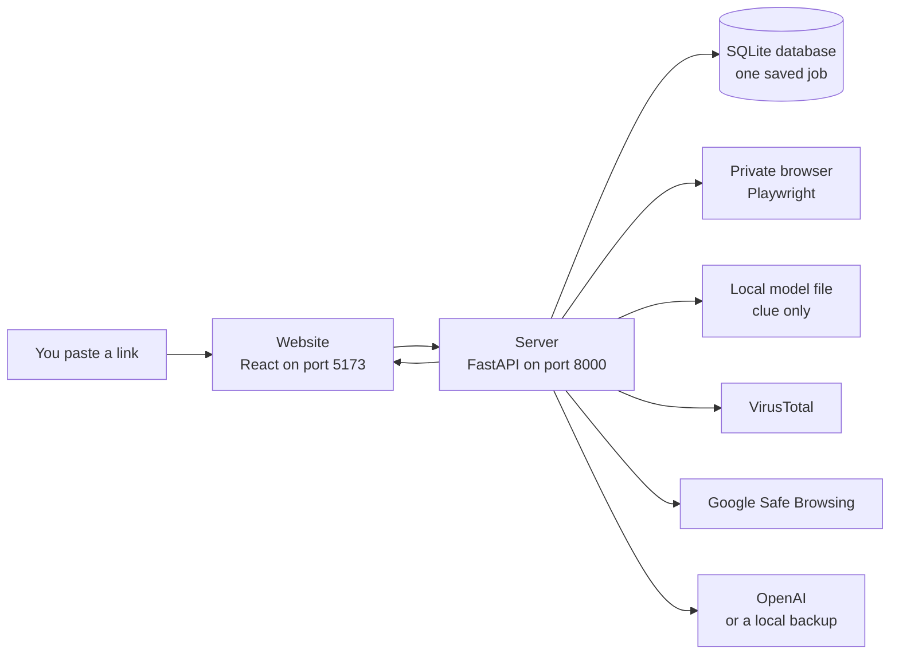
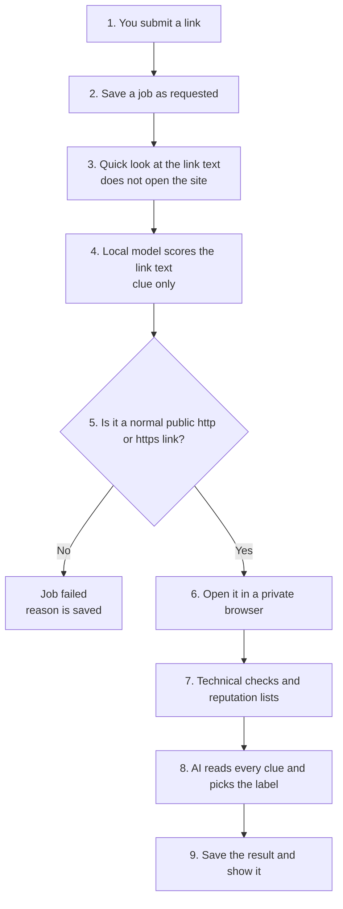

# ClickSafe progress

This page is a snapshot of **where the project is today**. It is written for someone who is new to the code. You do not need to know Python or React to follow it.

ClickSafe helps a person decide whether a web link looks safe **before** they open it in their normal browser. They paste a link. ClickSafe checks it and answers with one of three labels:

| Label | Meaning | Risk score |
| --- | --- | --- |
| **Safe** | Nothing important looks wrong | 0 to 30 |
| **Suspicious** | Some clues look off. Be careful | 31 to 69 |
| **Malicious** | Strong signs of a dangerous or fake site | 70 to 100 |

The label is a **risk judgment**, not a promise. A Safe result does not prove a site is harmless. A Malicious result does not prove a crime. It means “the evidence we collected points this way.”

The original build plan, Phases 1 through 8, is finished. After that plan, two extra checks were added in front of the deep scan. Those checks collect clues. They do **not** decide the final label by themselves.

## Where we are

```text
Done                         Done, but only as clues          Not on the live scan
------------------------     ----------------------------     -------------------------
Phases 1 to 8                Quick URL look (pre-scan)        Payment analyzer
Website you can click        Local phishing model             Agent planner
Browser visit + screenshot   Shown on the result page
Technical checks
VirusTotal + Safe Browsing
AI verdict, with a backup
```

If you only remember one rule, remember this:

> Words like `login`, `account`, `secure`, and `payment` are clues. A high score from the local model is also a clue. Neither one, by itself, makes a link Malicious.

## The app in one picture

ClickSafe is two programs on your computer, plus a few outside services.



Plain-language names for the boxes:

- **Website.** The page with the link box and the result panel. Built with React, TypeScript, and Tailwind. It runs at `http://127.0.0.1:5173`.
- **Server.** The program that does the real work. Built with Python and FastAPI. It runs at `http://127.0.0.1:8000`.
- **SQLite.** A single file, `backend/clicksafe.db`, that remembers each scan. It is created on your machine and is not uploaded to GitHub.
- **Playwright.** A robot browser. It opens the link in a fresh, private window, follows redirects, and saves a picture of the page.
- **Local model.** A small saved classifier that looks only at the text of the link.
- **VirusTotal and Google Safe Browsing.** Outside lists of known bad links. They run only when their keys are set.
- **OpenAI.** Reads the collected clues and writes the final label. If OpenAI is missing or rate-limited, a labeled local backup still finishes the scan.

## What happens when you press Scan



Steps 3 and 4 are wrapped so a crash there does not cancel the rest of the scan. If the private browser cannot open the page, the job is saved as **failed** and the screen offers a retry.

A scan can take up to about a minute, because a real browser has to load the page.

## The eight finished phases

The roadmap in [ROADMAP.md](ROADMAP.md) is complete. Each phase added one layer and left the earlier layers in place.

| Phase | What it added | Status |
| --- | --- | --- |
| 1. Foundation | Project folders, health check, empty dashboard, tests | Done |
| 2. Backend core | Link cleanup, saved jobs, status `requested` → `running` → `completed` or `failed` | Done |
| 3. Browser | Private Chromium visit, redirect list, screenshot, saved page HTML | Done |
| 4. Technical checks | DNS, SSL, WHOIS, HTML, page info, forms, JavaScript, redirects | Done |
| 5. Reputation | VirusTotal and Google Safe Browsing. One can fail without deleting the other | Done |
| 6. AI verdict | OpenAI writes Safe, Suspicious, or Malicious, plus a score and an explanation | Done |
| 7. Dashboard | The website shows the verdict, score, screenshot, redirects, and evidence | Done |
| 8. Hardening | Rate limit, body-size limit, block private networks, request logs, deployment notes | Done |

Phase 8 is still the number stored on each saved job (`lifecycle.phase` is `8`). The newer checks were added inside that same scan. They did not start a new public API or a new database table.

## Checks added after the roadmap

### 1. Quick URL look (pre-scan)

File: `backend/src/clicksafe/application/services/url_pre_scanner.py`

This step reads the link **as text**. It does not visit the website. The dashboard calls this block **Initial URL risk** and says it is not the final verdict.

It looks for things like:

- an IP address instead of a name, or an `@` in the link (30 points each)
- a famous brand name on the wrong domain (25 points)
- Punycode, the `xn--` form used to disguise letters (20 points)
- a risky-looking ending such as `.zip`, or a known link shortener (15 points)
- percent-encoded characters such as `%20` (10 points)
- a very long link, a very long domain, or many subdomains (smaller amounts)

The level bands are **low** (0–24), **medium** (25–54), and **high** (55–100).

Words such as `login` or `payment` are listed, then ignored by the score. Their point value is **0**. A real bank URL can contain those words.

### 2. Local phishing model

Files:

- `backend/src/clicksafe/application/services/ml_phishing_service.py`
- `backend/src/clicksafe/infrastructure/ml/phishing_classifier.py`
- `backend/src/clicksafe/infrastructure/ml/models/model.joblib`

This is a saved scikit-learn model: TF-IDF (it turns link text into word counts) plus logistic regression (it turns those counts into a probability). It was trained earlier in `previous_ml_project` and copied in. It was not retrained here.

It scores only the raw link text. The pre-scan’s structured features are saved beside it, but they are not fed into the model.

The dashboard calls this block **ML analysis** and says it is not the final verdict. You will see:

- phishing probability
- a class of `legitimate` or `phishing`
- the model name `LogisticRegression`
- up to 24 link tokens the model recognized

If the model file is missing or broken, the scan continues and this block says the model was unavailable.

The model learned a simple training pattern, so it can call an ordinary keyword-heavy link “phishing.” That is why its number is a clue, not the answer. Reputation lists can still mark a link Malicious when this model says legitimate. That happened on Google’s own Safe Browsing test pages: the model scored them as legitimate, and the reputation lists still produced Malicious with a risk score of 92.

### 3. A false alarm in the JavaScript check

The JavaScript analyzer used to treat `location.href` like `location.replace`. Ordinary pages, including the Google homepage, could look Suspicious because of that. It now matches `location.replace(` only. A page that only assigns `location.href` stays at info level.

## What the screen shows

The website is one page:

1. A box where you paste a link and press scan.
2. A result panel beside it.

While the scan runs, the panel says **Scanning**. If the network call fails, or the saved job failed, you can retry the same link.

A finished result shows:

- the label and a colored score bar
- the explanation
- **Initial URL risk** from the pre-scan
- **ML analysis**, with the sentence “This is not the final verdict.”
- validation details
- the private-browser result, redirect list, final address, and screenshot
- the AI block: provider, model, confidence, recommended action, and whether the backup scorer was used
- technical clues and reputation clues

Light and dark mode both work.

The server also has list and detail routes. The website currently calls only “analyze this link” and “give me the screenshot.”

## How the server is organized

```text
clickSafe/
├── frontend/          the website
│   └── src/
│       ├── App.tsx              scan button and result state
│       ├── components/          scanner, page shell, result panel
│       └── lib/api.ts           talks to the server
├── backend/
│   └── src/clicksafe/
│       ├── api/                 HTTP routes
│       ├── application/         the scan steps, in order
│       ├── analyzers/           one check per file
│       ├── domain/              job, label, and evidence shapes
│       ├── infrastructure/      browser, database, AI, model, reputation
│       └── main.py              starts the server
├── docs/              architecture and deployment notes
├── previous_ml_project/   older experiment that produced the model file
├── README.md          how to install and run
├── ROADMAP.md         the eight phases
└── PROGRESS.md        this page
```

The live scan is `AnalysisService.analyze` in `backend/src/clicksafe/application/services/analysis_service.py`. Everything else plugs into that one path.

## Routes you can call

All of these sit under `/api/v1`.

| Method | Path | What it does |
| --- | --- | --- |
| GET | `/health` | Says the server is up. Version `0.1.0`. |
| POST | `/analyze` | Runs a full scan and returns the job. |
| GET | `/analyses` | Lists recent saved jobs. |
| GET | `/analyses/{id}` | Returns one saved job. |
| GET | `/analyses/{id}/screenshot` | Returns that job’s PNG, after checking the file belongs to the job. |

In development, FastAPI also serves its own API docs.

## What is in the repo, but not in a live scan

Two pieces exist as code and are **not** called by `AnalysisService`:

- **Payment analyzer** (`backend/src/clicksafe/analyzers/payment.py`). It is a placeholder for payment or wallet clues. The default analyzer list does not include it.
- **Agent planner** (`backend/src/clicksafe/application/agent/`). It is an unused experiment. It is not part of the scan you get from the website.

`previous_ml_project/` is the older app that trained the model. The current website and server do not run that app. The useful piece that moved forward is `model.joblib`.

## Safety rules already in place

- Private, local, and special network addresses are blocked before the browser opens, and again while the page loads. This stops a submitted link from pointing the robot browser at your own machine.
- Scan submissions are rate-limited, and oversized request bodies are rejected.
- Logs are JSON and include a request id. They do not keep the query string of the URL.
- API keys live in `backend/.env` on your machine. That file is gitignored. Do not commit it.
- Google Safe Browsing is for non-commercial use. A commercial deploy should switch to Google Web Risk. See [docs/deployment.md](docs/deployment.md).

## Known limits

- If OpenAI returns a rate-limit error, the backup scorer uses the strongest local clue. Info becomes 8, low becomes 25, medium becomes 50. A score of 50 is Suspicious, and the result says the backup was used.
- The local model can over-call keyword-heavy legitimate links as phishing. Read it next to the other clues.
- If the server process dies in the middle of a scan, that job can stay `running` in the database.
- The main [README.md](README.md) install steps create a folder named `.venv`. The copy on this machine already uses `backend\venv` instead. Both are valid virtual environments. Use the one that exists.
- DNS, SSL, WHOIS, the payment analyzer, and the agent package do not have their own test files yet. The scan path, pre-scan, model, JavaScript check, reputation clients, and the result panel do.

## How to run it on this machine

From `backend`, with that folder as the current directory so `.env` and the database resolve:

```powershell
cd backend
.\venv\Scripts\uvicorn.exe clicksafe.main:app --reload --host 127.0.0.1 --port 8000 --app-dir src
```

In a second terminal:

```powershell
cd frontend
npm run dev
```

Open `http://127.0.0.1:5173`. Health check: `http://127.0.0.1:8000/api/v1/health`.

A fresh clone can follow the install steps in [README.md](README.md). Copy `.env.example` to `.env` and fill in the provider keys you have. Without those keys, scans still finish: reputation says the provider is disabled, and the AI block uses the local backup.

## Tests that cover today’s behavior

Backend, from `backend` with the project virtual environment:

```powershell
.\venv\Scripts\pytest.exe
```

Website:

```powershell
cd frontend
npm test
npm run test:e2e
```

## Words used in the code

| Word | Means |
| --- | --- |
| URL | The link text, such as `https://example.com/path`. |
| Verdict | The final label: Safe, Suspicious, or Malicious. |
| Evidence | One saved clue. Many clues are combined into the verdict. |
| Job | One scan, stored with an id, a status, and the evidence JSON. |
| Redirect | The page sends the browser to a different address before it settles. |
| Phishing | A fake page that tries to trick someone into handing over secrets. |
| Pre-scan | The quick text-only look that happens before the browser opens. |
| Fallback | The local backup scorer used when OpenAI does not answer. |

## Read next

- [README.md](README.md) for install commands and environment variables
- [ROADMAP.md](ROADMAP.md) for the phase-by-phase plan
- [PROJECT_DETAILS.md](PROJECT_DETAILS.md) for the longer feature reference
- [docs/architecture.md](docs/architecture.md) for how the code layers depend on each other
- [docs/deployment.md](docs/deployment.md) before running this anywhere except your own computer
